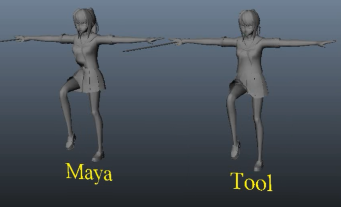

# Maya
Repository for maya tools, mainly for game modding

**Profiler** 
&nbsp;&nbsp;&nbsp;&nbsp;Simple script to profile maya for performance issue
    
**Skin Influence Rebalance** 
&nbsp;&nbsp;&nbsp;&nbsp;A way to reblance skin influences from a higher to a lower maximum count 
 
When setting the maximum skin influence to a lower count (from 5 to 3) in maya; Skin > Edit Influences > Set Max Influences 
Maya does not bother redistributing the weights and brute forces the values into the vertices casuing the previously weighted skin to become a mess 
The script fixes this by redistributing the values equitably giving a smoother deformation  
Used to port Unity Models which have a max influence of 5 into Super Smash Brothers; max influence of 3
